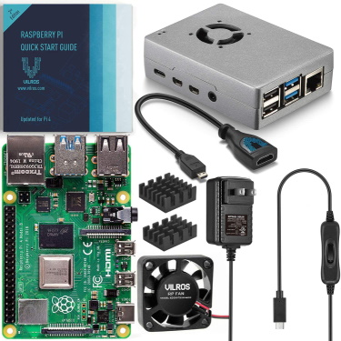
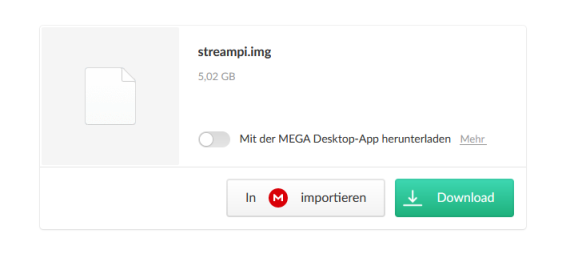
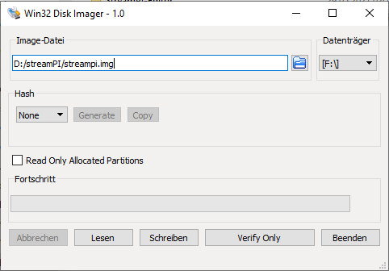
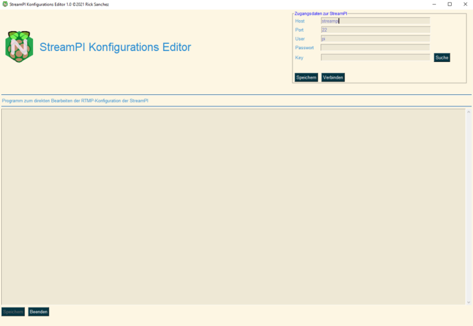
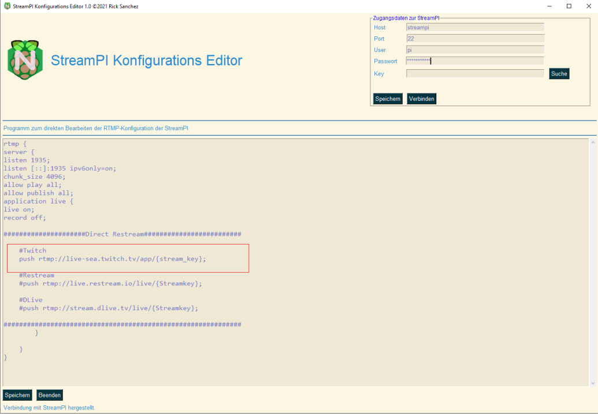

# StreamPI - Kostenlose Restreamlösung für Raspberry Pi
 Der "StreamPi Editor" ist die Steuersoftware für die "StreamPI", einer speziell konfigurierten RaspberryPI (Einplatinencomputer im EC-Karten-Format), die als Streaming- und Restreamserver fungiert. Mithilfe des StreamPI Editors kann die Konfiguration der StreamPI dann von jedem Rechner aus der Ferne kontrolliert werden, ohne Konselenbefehle etc.
 Das ist gerade für Leute interessant, die über Youtube, Twitch, Trovo oder DLive streamen und denen die kostenlosen Möglichkeiten von Restream.io zu wenig sind.
 Im Folgenden findet sich eine einfache Punkt-für-Punkt Anleitung, wie man eine Standard-StreamPI aufsetzt und mit diesem Editor kontrolliert. Dabei wird ein vorkonfiguriertes Image benutzt für die RaspberryPI, welches einfach nur heruntergeladen und auf eine microSD-Karte kopiert werden muss.

 Wer keine vorkonfigurierten Images mag, findet weiter unten die Anleitung "from Scratch", die erklärt, wie man sich eine StreamPI komplett selbst konfiguriert.


## Anleitung mit Hilfe des StreamPI-images
### Einrichtung der StreamPI
#### 1. RaspberryPI besorgen
Es wird eine RaspberryPI 3 oder höher benötigt, damit der Streaming-Server auch genug Luft zum Arbeiten hat. Sucht euch einfach am Besten ein Set, wo die PI und Gehäuse sowie Kühler und Lüfter schon mit dabei sind. Das Ganze ist dann in fünf Minuten zusammengebaut.
Ihr braucht zusätzlich noch eine schnelle microSD-Karte, 32 GB sollten es da schon sein.



#### 2. StreamPI Image downloaden und auf SD-Karte klonen
Das offizielle Image einer komplett für das Streaming vorkonfigurierten und optimierten StreamPI kann man hier herunterladen:

##### [Download StreamPI Image](https://mega.nz/file/EQI3wAwZ#2UC5Rse4YukLyoF1ltkkWXVmoh2fQBUjOrBPsJkkHFA)



Anschließend mit dem Programm Win32 Imager das Image auf eine microSD-Karte kopieren.

##### [Download Win32 Imager](https://win32-disk-imager.de.uptodown.com/windows)




Die SD Karte im Anschluss daran in die RaspberryPI stecken und die PI anschalten.

Die "StreamPI" kann auch über WLan betrieben werden, ich empfehle aber die Verwendung über Lan-Kabel, auch weil dann die Einrichtung an der StreamPI entfällt, ansonsten muss man jetzt die StreamPI an einen Monitor, Tastatur und Maus anschließen und dann die WLAN-Verbindung einrichten.

### Einrichtung des StreamPI Editors
#### Python installieren
Zur Verwendung des StreamPI Editors auf dem Streaming-Rechner muss auf diesem Python in der Version 3.8 oder höher installiert sein. Ich empfehle Windows, es funktioniert aber natürlich auch unter Mac oder Linux, is nur von mir nicht getestet worden, also ohne Gewähr.

Python kann hier heruntergeladen und installiert werden: https://www.python.org/downloads/

Wichtig: Bei der Installation darauf achten, dass die PATH oder "Umgebungsvariablen" upgedatet werden, sonst funktioniert später das Programm nicht.

### Download und Start des StreamPI Editors
Sobald die StreamPI im Netzwerk läuft und Python auf dem Rechner, von welchem aus die StreamPI kontrolliert werden soll, installiert ist, einfach den StreamPI Editor hier downloaden:

##### [Download StreamPI Editor](https://github.com/ibuntuos/StreamPI-Editor/releases)

Anschließend entpacken und die Datei "StreamPI Editor.pyw" starten.


Der Editor lädt sich mit der Standard-Konfiguration:




In der rechten oberen Ecke sieht man wie bei einem normalen SSH oder FTP-Client die Eingabefelder für die Zugangsdaten. Bei Verwendung des vorkonfigurierten StreamPI-Images muss man hier lediglich das Passwort eintragen.

Das Standard-Passwort ist:
```
  streampi1#X
```

Danach auf den "Speichern" Button bei den Zugangsdaten klicken und anschließend auf "Verbinden".


### Verwendung des StreamPI Editors
Der StreamPI Editor lädt sich die Standard-RTMP-Konfiguration von der StreamPI im Netz und öffnet sie zum Bearbeiten.

Der Vorteil der StreamPI liegt darin, dass sie den Stream an viele Plattformen weiterleiten kann, eben wie "Restream.io", nur ohne Beschränkungen.

#### Hinzufügen von Plattform an die weiter gestreamt werden soll
* Um das Streaming-Signal der StreamPI auf mehrere Plattformen wie Twitch, Youtube etc. weiterzuleiten, nutzt man die "push"-Funktionalität der StreamPI. Hierfür gibt man dem Server einfach per "push" Befehl das Kommando zum Weiterleiten - sagen wir z.B. zu Twitch.

* Hierfür ändert man die Standard-Konfiguration, die im StreamPI Editor geladen wird, wie folgt:

* Man fügt im Bereich "Direct Restream" folgende Zeile hinzu:
```
push rtmp://live-sea.twitch.tv/app{stream_key};
```
* Das abschließende Semikolon ist hier sehr wichtig, sonst funktioniert der ganze Server nicht - jeder "push"-Befehl muss mit einem Semikolon beendet werden.

* Hierbei wird natürlich "{stream_key}" durch den eigenen Streamingkey des Streaminganbieters ersetzt.

* Das Ganze sieht dann in etwa so aus:


* Danach auf den unteren "Speichern" Button klicken. Dies schreibt die Konfiguration zurück auf die StreamPI und macht sie bereit, Signale anzunehmen.

### Einrichtung in Streamingsoftware
Um jetzt auch über die StreamPI streamen zu können, muss z.B. in OBS bei den Streaming-Einstellungen folgender Server angesprochen werden:

```
rtmp://streampi:1935/live
```

### Sicherheitshinweis
Es wird empfohlen das Passwort und den Benutzername der StreamPI zu ändern, da beim vorkonfigurierten Image alles auf Standard-Einstellungen gelassen wurde.

Ich empfehle die Verwendung von Keyfiles für die Verbindung zur StreamPI aber ein sicheres Passwort tut es natürlich auch.

***

## Anleitung "from Scratch"
Hier nun die Anleitung wie man sich selbst eine "StreamPI" einrichtet. Richtet sich an Bastler und Fortgeschrittene

### Einrichtung der StreamPI
#### 1. RaspberryPI OS besorgen und Grundsystem installieren
  * RaspberryPI OS muss zunächst eingerichtet werden, am Besten mit dem Raspberry Pi Imager (https://www.raspberrypi.org/documentation/installation/installing-images/)

#### 2. Zugriff auf die RaspberryPI mittels Keyfile und SSH einrichten
  * Eine Gute Anleitung dazu findet sich hier: https://jankarres.de/2013/12/raspberry-pi-ssh-schluessel-erstellen-und-passwort-aendern/
  * Hierbei den "Public Key" nicht als Datei speichern sondern sich aus dem Textfeld von Puttygen in die Zwischenablage kopieren und dann auf der RaspberryPI unter "authorized_keys" wie in der Anleitung beschrieben kopieren.
  * Den "Private Key" als OpenSSH-Key exportieren.
  * Wichtig: Den "Private Key" unbedingt sichern, er wird später im "StreamPI Editor" benötigt.
  * Sollte man einen eigenen User zur besseren Absicherung der StreamPI einrichten wollen, so muss man diesem das Recht einräumen, ohne Passwort "sudo" Kommandos abzusetzen. Wie das geht ist hier beschrieben: https://www.cyberciti.biz/faq/linux-unix-running-sudo-command-without-a-password/

#### 3. Installation und Einrichtung von NGINX
  * Um einen NGINX-RTMP Server einzurichten wird im Terminal der RaspberryPI folgendes eingegeben:
  ```
  sudo apt-get update
  sudo apt-get install nginx libnginx-mod-rtmp
  sudo nano /etc/nginx/rtmp.conf
  ```

  * In der sich dann öffnenden Datei gebt ihr folgendes ein:

  ```
  rtmp {
  server {
    listen 1935;
    listen [::]:1935 ipv6only=on;
    chunk_size 4096;
    allow play all;
    allow publish all;
    application live {
    live on;
    record off;

    #####################Direct Restream#########################

        #Restream
        #push rtmp://live.restream.io/live/{Streamkey};

        #DLive
        #push rtmp://stream.dlive.tv/live/{Streamkey};

    #############################################################
            }

        }
    }
  ```
  * Dies ist eine Beispieldatei die schon für das Streaming sowohl über IPv4 als auch IPv6 (DS-Lite wie bei Deutscher Glasfaser oder Vodafone Kabel) eingerichtet ist.
  * Ebenfalls sind in dieser Datei schon mal Dummy-URLs für das Verteilen nach Restream oder direkt nach DLive.tv. Konkrete Streaming-Einstellungen für z.B. Facebook kann im Internet finden.
  * Nach der Eingabe das ganze mit STRG+X speichern und bestätigen.
  * Danach die die NGINX-Konfigurationsdatei öffnen mit:

  ```
  sudo nano /etc/nginx/nginx.conf
  ```  

  Und dort dann als letzte Zeile eingeben:

  ```
    include /etc/nginx/rtmp.conf;
  ```

  * Anschließend den Server neustarten:

  ```
    sudo systemctl restart nginx
  ```

  * Es gibt noch das Problem, dass NGINX bei den RaspberryPIs aufgrund eines zu geringen Timeouts nicht beim Booten startet. Dies ist leicht zu beheben. Einfach folgende Datei editieren:

  ```
  sudo nano /lib/systemd/system/nginx.service
  ```
  Dort im Bereich "[Service]" folgende Zeile auskommentieren und durch die nachfolgende ersetzen:

  ```
  #ExecStartPre=/usr/sbin/nginx -t -q -g 'daemon on; master_process on;'
  ExecStartPre=/bin/sleep 3
  ```
  als letzten Eintrag im "[Service]" Bereich der Datei dann noch folgendes eintragen:

  ```
  Restart=always
  ```

  Anschließend die Datei speichern und den Service neu laden:
  ```
  sudo systemctl enable nginx
  ```

Zur Verwendung des StreamPI Editors siehe Anleitung weiter oben.

***


So long und Danke für den vielen Fisch!
Kontakt: wochenschau@protonmail.com
